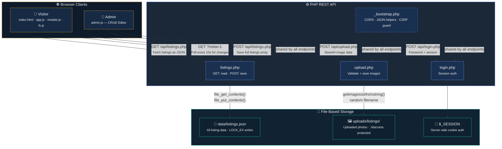

<p align="center">
  
</p>


A rental listing platform for a property management business in London, Ontario. The owner manages all listings through a browser-based admin panel — no database server, no developer needed for day-to-day operations.

---

## The Problem

The client runs a small rental business (~10–50 active listings) on shared hosting (Hostinger). Their requirements:

- Add, edit, and remove listings without touching code
- Upload property photos directly from the browser
- No MySQL/PostgreSQL setup, no database credentials, no migrations
- Deploy by uploading files — no SSH, no CLI, no build step

A traditional stack (React + Express + PostgreSQL) would have required a VPS, a running process manager, and ongoing database maintenance. That was overkill for this use case.

---

## Architecture



### Data Flow

1. **Visitor loads the page** → `app.js` calls `GET /api/listings.php` → PHP reads `data/listings.json` with `file_get_contents()` → returns JSON array.
2. **Admin saves a listing** → `admin.js` calls `POST /api/listings.php` with the full listings array → PHP writes to `data/listings.json` with `file_put_contents($path, $data, LOCK_EX)`.
3. **Admin uploads a photo** → `admin.js` sends base64 image data to `POST /api/upload.php` → PHP validates, saves to `uploads/listings/` with a random filename, returns the URL.
4. **Polling for changes** → `app.js` polls `GET /api/listings.php?meta=1` every 10 seconds to detect if another session changed the data (compares `filemtime()` version stamps).

---

## Why PHP (and Not Node.js or Python)

This wasn't a default choice. PHP is the right tool for this specific deployment target:

| Constraint | PHP | Node.js / Python |
|---|---|---|
| Hostinger shared hosting | Pre-installed, zero config | Requires VPS ($5–20/mo extra) |
| Deployment method | Upload files via File Manager | Requires SSH + `npm install` + PM2 |
| File I/O | `file_get_contents()` / `file_put_contents()` — synchronous, one call | Async by default, needs careful error handling for atomic writes |
| Session auth | Built-in `$_SESSION` with `session_start()` | Requires middleware (`express-session`, etc.) |
| Process model | Shared hosting runs PHP per-request — no daemon to crash | Needs a persistent process and a process manager |

**Trade-off acknowledged:** PHP's per-request model means no WebSocket support and no in-memory caching. The 10-second polling interval is a pragmatic workaround.

## Why JSON Instead of MySQL

`data/listings.json` is a flat-file data store. It is not "database-less" — it *is* a database, just file-based instead of relational.

**Where this works well:**
- Small dataset (< 500 listings)
- Single admin (one writer at a time)
- Low write frequency (a few edits per day)
- Simple queries (no joins, no full-text search, no aggregation)

**Where this breaks down:**
- **Concurrent writes** — If two admins save simultaneously, the last write wins. `LOCK_EX` prevents file corruption (partial writes), but does not merge changes. One update gets overwritten.
- **Scale** — Every save rewrites the entire file. At 5,000+ listings with frequent writes, this becomes a bottleneck.
- **No indexing** — Filtering happens client-side in JavaScript. There is no server-side query engine.
- **No transactions** — There is no rollback if a write partially fails at the application level.

For this client's volume (~20 listings, single admin, a few edits per week), the trade-off is appropriate.

## Why Vanilla JavaScript (No React/Vue/Angular)

The frontend is four plain JS files with no build step, no bundler, no `node_modules`.

**Reasons:**
- **Deployment simplicity** — The client uploads files via Hostinger File Manager. There is no `npm run build` step.
- **Zero dependencies** — No version conflicts, no security advisories from `npm audit`, no breaking changes on updates.
- **Payload size** — Total JS payload is ~65 KB across 4 files. A React bundle with dependencies would be 150–300 KB+ gzipped.
- **Maintainability for this scale** — With 4 files and ~1,100 lines total, a framework would add complexity without proportional benefit.

**Trade-off acknowledged:** No component model, no virtual DOM diffing, no state management library. The code uses global functions (`window.LR_Store`, `window.LR_openDetail`) for inter-module communication. This would not scale to a 50-screen SPA.

---

## Security Implementation

### Authentication
- Admin login is a server-side PHP session (`$_SESSION['lr_admin']`). The session ID is stored in an `HttpOnly` cookie managed by the server — not in `localStorage` or a JWT in the browser.
- On successful login, `session_regenerate_id(true)` is called to prevent session fixation attacks.
- Password is compared using `hash_equals()` (constant-time comparison) to prevent timing attacks.

### CSRF Protection
- All mutating endpoints (`POST`) require the custom header `X-Requested-With: fetch`. A cross-origin `<form>` submission cannot set custom headers, so this blocks CSRF from external sites without needing tokens.
- No CORS headers are set, so browsers block cross-origin `fetch()` requests entirely.

### Upload Validation
- **MIME regex** — Only accepts `data:image/(png|jpeg|jpg|webp|gif);base64,...`
- **Binary verification** — After base64 decoding, `getimagesizefromstring()` confirms the bytes are actually a valid image (not a renamed PHP script).
- **Size cap** — 6 MB maximum per image (`strlen($bin) > 6 * 1024 * 1024`).
- **Random filenames** — Uploaded files get `'l' . bin2hex(random_bytes(8))` names (e.g., `l5de08691a155b013.jpg`), preventing filename prediction and directory traversal.
- **Execution prevention** — The `uploads/listings/.htaccess` disables the PHP engine (`php_flag engine off`) and denies access to all executable file extensions (`.php`, `.py`, `.sh`, `.cgi`, etc.).

### What's NOT Implemented
- **No rate limiting** on login attempts (brute-force is possible).
- **Password is stored in plaintext** in `config.php`, not as a bcrypt hash. It's server-side only (never sent to the client), but `password_hash()` / `password_verify()` would be better.
- **No XSS sanitization on output** — Listing data entered by the admin is rendered without server-side HTML escaping. The frontend uses a client-side `esc()` function for HTML entity encoding, but this relies on the admin not being malicious (acceptable since admin = owner).
- **No Content Security Policy headers**.

---

## Features

| Feature | Implementation |
|---|---|
| Property listing grid | `app.js` renders cards from `LR_Store.all()`, sorted with Available above Rented |
| Type filtering | Client-side filter chips (All / House / Apartment / Condo / Townhome) — CSS `display:none` toggle |
| Listing detail modal | `modals.js` — full-screen overlay with photo gallery, embedded Google Maps iframe, property description |
| Multi-image gallery | Arrow navigation, dot indicators, counter — supports mixed images + MP4 video |
| Tenant inquiry form | Pre-fills a `mailto:` link with applicant details (name, credit score, pets, cars, lease length) |
| Landlord submission wizard | 4-step modal flow: Services → What's Included → Fees → Submit Property (also `mailto:`) |
| Admin CRUD panel | `admin.js` — hidden behind `#admin-kunal` URL hash + password gate |
| Photo upload | Drag-drop or URL input → base64 → `POST /api/upload.php` → saved to server |
| Near-real-time sync | 10-second polling via `GET /api/listings.php?meta=1` comparing `filemtime()` |
| Offline fallback | If PHP API is unreachable, falls back to `localStorage` so the site works as a static file |
| Scroll animations | GSAP + ScrollTrigger batch reveals with stagger, hero parallax, accessibility: respects `prefers-reduced-motion` |
| Custom cursor | Gold dot + ring cursor on desktop (pointer devices only), with hover-grow on interactive elements |
| Mobile responsive | Hamburger nav drawer, responsive grid, touch-friendly modals |

### Not Implemented
- Server-side search / full-text search
- Pagination (all listings render at once)
- User accounts / tenant login
- Favorites / saved listings
- Availability calendar
- Email notifications (inquiries use `mailto:` links)

---

## Project Structure

```
project/
├── index.html                  # Single-page HTML (all sections)
├── app.js                      # Data store (LR_Store), listing renderer, filters, nav
├── modals.js                   # Tenant inquiry, landlord wizard, listing detail modal
├── admin.js                    # Admin CRUD: login gate, editor, photo upload
├── fx.js                       # GSAP scroll reveals, parallax, custom cursor
│
├── api/
│   ├── _bootstrap.php          # Session init, JSON helpers, CSRF guard, admin check
│   ├── config.php              # Admin password, file paths
│   ├── listings.php            # GET: read listings / POST: save listings (admin)
│   ├── login.php               # GET: auth status / POST: login/logout
│   └── upload.php              # POST: validate + save uploaded images
│
├── data/
│   └── listings.json           # All listing data (the flat-file store)
│
├── uploads/
│   └── listings/               # Uploaded property photos
│       └── .htaccess           # Disables PHP execution in this directory
│
└── assets/                     # Static images, logos
```

---

## API Endpoints

| Endpoint | Method | Auth | Description | Response |
|---|---|---|---|---|
| `api/listings.php` | `GET` | No | Fetch all listings | `{ version: "...", listings: [...] }` |
| `api/listings.php?meta=1` | `GET` | No | Fetch version only (for polling) | `{ version: "..." }` |
| `api/listings.php` | `POST` | Admin | Save full listings array | `{ ok: true, version: "..." }` |
| `api/login.php` | `GET` | No | Check session status | `{ admin: true/false }` |
| `api/login.php` | `POST` | No | Login with password | `{ ok: true }` or `401` |
| `api/login.php` | `POST` | Admin | Logout (`action: "logout"`) | `{ ok: true }` |
| `api/upload.php` | `POST` | Admin | Upload base64 image | `{ ok: true, url: "..." }` or `400/413` |

All endpoints return JSON with appropriate HTTP status codes (200, 400, 401, 403, 405, 413, 500).

---

## Technologies Used

| Category | Technology | Purpose |
|---|---|---|
| Markup | HTML5 (semantic elements) | Page structure, SEO |
| Styling | Vanilla CSS (custom properties) | Design system, responsive layout |
| Frontend logic | Vanilla JavaScript (ES6+ IIFEs) | DOM rendering, Fetch API, FormData, event handling |
| Animation | GSAP 3 + ScrollTrigger | Scroll reveals, parallax, cursor effects |
| Backend | PHP 7.4+ | REST endpoints, session management, file I/O |
| Auth | PHP `$_SESSION` | Server-side cookie-based authentication |
| Data | JSON flat-file | Listing persistence via `file_get_contents` / `file_put_contents` |
| Upload | PHP `getimagesizefromstring()` | Binary image validation |
| Maps | Google Maps Embed | Location display in listing detail modal |
| Hosting | Hostinger shared hosting | PHP pre-installed, no server config needed |

---

## Deployment

```bash
# 1. Upload project/ contents to public_html/ on Hostinger (via File Manager or FTP)
# 2. Edit api/config.php — set your admin password
# 3. Ensure data/ and uploads/listings/ are writable (chmod 775)
# 4. Visit yourdomain.com — done
```

No `npm install`. No database migrations. No `.env` files. No build step.

---

## Concurrency & Backup

### Concurrent Writes
`file_put_contents()` is called with `LOCK_EX`, which acquires an exclusive file lock. This prevents two simultaneous writes from corrupting the file (no partial writes). However, it does **not** merge changes — the last write wins. For a single-admin use case, this is acceptable.

### Backup Strategy
Currently, there is no automated backup. The `data/listings.json` file can be manually downloaded as a backup. For production hardening, a cron job copying the file to a dated backup would be straightforward:
```bash
cp data/listings.json data/backups/listings-$(date +%Y%m%d).json
```

---

## Engineering Challenges

| Challenge | Solution |
|---|---|
| Atomic file writes on shared hosting | `file_put_contents()` with `LOCK_EX` flag for exclusive locking |
| Upload security on a PHP host | Regex MIME check + `getimagesizefromstring()` binary validation + `.htaccess` execution block |
| Near-real-time sync without WebSockets | 10-second polling on `filemtime()` version stamps (cheap metadata-only endpoint) |
| Offline / no-PHP fallback | `app.js` catches `fetch()` errors and falls back to `localStorage` + hardcoded defaults |
| CSRF without token infrastructure | Custom `X-Requested-With: fetch` header requirement (cross-origin forms can't set custom headers) |
| Smooth animations with accessibility | GSAP animations wrapped in `prefers-reduced-motion` checks — everything degrades to static |

---

## Future Improvements

- Migrate to SQLite (still file-based, but with indexing and concurrent reads) for scale beyond 500 listings
- Hash the admin password with `password_hash()` / `password_verify()` (bcrypt)
- Add rate limiting on `login.php` to prevent brute-force
- Server-side image optimization (resize + WebP conversion via GD/Imagick)
- Email notifications on new tenant inquiries (instead of `mailto:` links)
- Add Content Security Policy headers
- Implement proper search with a server-side endpoint
- Add pagination for large listing counts

---

*Built as a practical solution for a small business on shared hosting. The architecture intentionally prioritizes deployment simplicity and zero maintenance over scalability.*
